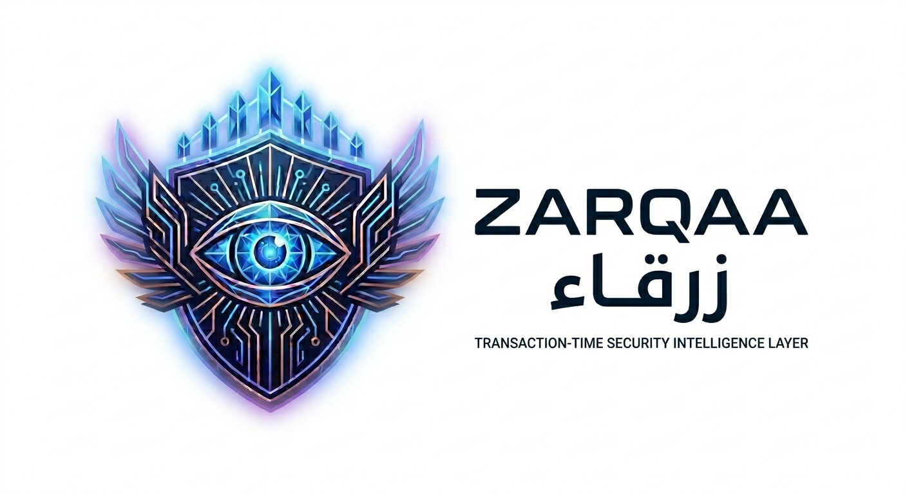

# Zarqaa — زرقاء

> *"She was the only one who saw them coming."*



---

## The Story

In ancient Arabia, a woman named **Zarqaa al-Yamama** of the Jadis tribe possessed eyesight so sharp she could see a rider from three days' distance. When an enemy army approached, camouflaged behind cut trees, she was the only one who saw them. She warned her tribe. They dismissed her. The army arrived. The tribe fell.

We named this tool after her because she is the original early warning system — and because the story of being right, being ignored, and watching the damage happen is one that everyone in Web3 security knows by heart.

---

## What is Zarqaa

Zarqaa is a **transaction-time security intelligence layer for Web3**.

It accepts a transaction in two states — one you are about to sign, or one already submitted — resolves the full execution path, inspects every contract your transaction will touch, and returns a per-component security report in real time.

**It answers one question:**

> *"Is the infrastructure this transaction depends on trustworthy — and has any of it been compromised recently?"*

It does **not** simulate outcomes, predict price, or replace your wallet. It aggregates trust signals at the point of decision.

**Silence is never treated as safe.** Every unresolvable component emits `UNKNOWN` + a reason code. Nothing is silently skipped or assumed green.

---

## What We Built

### Two Ways to Use Zarqaa

**1. Web Scanner (`app/`)** — for end users who want to inspect a transaction or intent directly in the browser. Paste a tx hash or describe what you're about to do and get a full security report.

**2. AI Agent integration (`agent_framework/`)** — OpenClaw AI trading agent with Zarqaa wired in as a pre-transaction safety gate. Before the agent executes any on-chain action, it calls Zarqaa through the AXL mesh. Green = proceed. Amber = warn + ask. Red = block.

---

### Architecture

```
┌─────────────────────────────────────────────────────────────────────────────┐
│                              YOUR MACHINE                                   │
│                                                                             │
│  ┌──────────────────────────┐          ┌──────────────────────────────────┐ │
│  │   NODE A  (Zarqaa)       │          │   NODE B  (OpenClaw Agent)       │ │
│  │                          │          │                                  │ │
│  │  :9002  AXL HTTP API     │◄─ mesh ─►│  :9012  AXL HTTP API            │ │
│  │  :7100  P2P TLS          │          │  :7100  P2P TLS (outbound only)  │ │
│  │  :8080  Zarqaa Gateway   │          │                                  │ │
│  │  :9003  MCP Router       │          │  OpenClaw AI agent (Docker)      │ │
│  │                          │          │  safety_guard.py                 │ │
│  └──────────────────────────┘          └──────────────────────────────────┘ │
│                                                                             │
│  app/  Next.js web scanner  :3000  (user-facing, direct to gateway)        │
│                                                                             │
│  Agent flow:  safety_guard.py → Node B :9012 ─mesh─► Node A → MCP Router  │
│               → Zarqaa Gateway :8080 → analysis → verdict                  │
└─────────────────────────────────────────────────────────────────────────────┘
```

### Components

| Component | Location | What we built |
|---|---|---|
| **Zarqaa Gateway** | `zarqaa-core/` | Our core — Rust/Axum analysis engine, REST + MCP endpoints |
| **Web Scanner UI** | `app/` | Our frontend — Next.js, intent + tx-hash modes, full results UI |
| **OpenClaw Agent** | `agent_framework/` | Our integration — AI trading agent with Zarqaa safety gate |
| **Safety Guard** | `agent_framework/workspace-template/safety_guard.py` | Our script — agent calls this before any tx |
| **AXL Node configs** | `third_party/axl/configs/` | Our config — node-a.json and node-b.json |
| **AXL** | `third_party/axl/` (git submodule) | Third-party — Yggdrasil P2P mesh by [gensyn-ai/axl](https://github.com/gensyn-ai/axl) |

### Analysis Pipeline (8 stages, per contract leg)

| Stage | What it does |
|---|---|
| Path resolver | Decode full call graph, extract every contract leg |
| Contract inspector | Source verification, proxy detection |
| Ownership mapper | EOA vs multisig vs DAO, timelock detection |
| Audit verifier | Last audit date vs last proxy upgrade date |
| Exploit scanner | CVEs, Rekt DB, post-mortems |
| MEV analyzer | Sandwich risk, Flashbots exposure |
| Trust aggregator | Per-leg scoring, weakest leg drives route verdict |
| Report renderer | Streamed JSON — Green / Amber / Red / Unverified |

### Zarqaa Gateway API

Three endpoints on `http://127.0.0.1:8080`:

| Endpoint | Description |
|---|---|
| `POST /analyze` | tx hash → full security report |
| `POST /analyze-intent` | natural language / calldata → pre-sign report |
| `POST /mcp` | MCP JSON-RPC — used by AXL mesh routing |

Source: [`zarqaa-core/src/gateway/src/main.rs`](zarqaa-core/src/gateway/src/main.rs) · [`zarqaa-core/src/gateway/src/routes.rs`](zarqaa-core/src/gateway/src/routes.rs)

---

## How We Use AXL

[AXL](https://github.com/gensyn-ai/axl) is a Yggdrasil-based encrypted P2P overlay mesh by gensyn-ai. It is included as a **git submodule** at `third_party/axl/`. We use it as-is — no modifications to AXL source code.

**What we contribute:**
- Two node configs: [`third_party/axl/configs/node-a.json`](third_party/axl/configs/node-a.json) and [`third_party/axl/configs/node-b.json`](third_party/axl/configs/node-b.json)
- A `POST /mcp` endpoint on the Zarqaa Gateway that speaks MCP JSON-RPC, so AXL's built-in MCP router can call it
- `safety_guard.py` — the agent calls Node B's AXL HTTP API to route security checks through the mesh to Zarqaa

**What AXL provides out of the box:**
- `axl-node` binary — starts a Yggdrasil node with an HTTP API
- `POST /mcp/{peer_id}/{service}` — routes a JSON-RPC call through the overlay to a remote peer's registered service
- `integrations/mcp_routing/mcp_router.py` — Python service registry on Node A; maps service names (e.g. `zarqa`) to HTTP endpoints

### Node configuration

**Node A** — [`third_party/axl/configs/node-a.json`](third_party/axl/configs/node-a.json)
```json
{
  "PrivateKeyPath": "configs/private-a.pem",
  "Peers": [],
  "Listen": ["tls://0.0.0.0:7100"],
  "api_port": 9002,
  "tcp_port": 7100,
  "router_addr": "http://127.0.0.1",
  "router_port": 9003
}
```
`router_addr` + `router_port` tell Node A to forward incoming MCP calls to the MCP router at `:9003`.

**Node B** — [`third_party/axl/configs/node-b.json`](third_party/axl/configs/node-b.json)
```json
{
  "PrivateKeyPath": "configs/private-b.pem",
  "Peers": ["tls://127.0.0.1:7100"],
  "api_port": 9012,
  "tcp_port": 7100
}
```
Node B dials Node A on startup. No router needed — it only sends, never receives.

> **tcp_port note:** Both nodes share `tcp_port: 7100`. AXL's `DialPeerConnection` connects to the remote peer's Yggdrasil overlay IPv6 at the *local* node's `tcp_port`. Both nodes bind to their own unique overlay IPv6, so there is no port conflict on the same machine.

### Registering the zarqa service

After both nodes are up, register the Zarqaa gateway with Node A's MCP router:

```bash
curl -X POST http://127.0.0.1:9003/register \
  -H "Content-Type: application/json" \
  -d '{"service":"zarqa","endpoint":"http://127.0.0.1:8080/mcp"}'
```

This is done automatically by [`start.sh`](start.sh). After registration, any AXL node that knows Node A's peer ID can call Zarqaa over the mesh with:

```
POST http://{any_node_api}/mcp/{node_a_peer_id}/zarqa
```

### How a call travels

```
safety_guard.py
  └─ POST http://127.0.0.1:9012/mcp/{nodeA_peer_id}/zarqa   (Node B HTTP API)
       └─ AXL: dial Node A over Yggdrasil overlay (TLS)
            └─ Node A receives call → forwards to MCP Router :9003
                 └─ MCP Router looks up "zarqa" → POST http://127.0.0.1:8080/mcp
                      └─ Zarqaa Gateway runs analysis → returns verdict
```

### Current peer IDs

| Node | Public Key | IPv6 | API |
|---|---|---|---|
| A (Zarqaa service) | `5bcb2a071ed712d23bd97ce15b1aec892dd195fa18e67b061c22c2edfa45fd85` | `201:90d3:57e3:84a3:b4b7:109a:c7a:9394` | `:9002` |
| B (OpenClaw agent) | `d1c50ffa17bb8ea243c5a03f2c18a235dc6a5252e95ac9a9df11c9a5785ae175` | `200:5c75:e00b:d088:e2bb:7874:bf81:a7ce` | `:9012` |

---

## How to Run

### Prerequisites

| Tool | Version | Used for |
|---|---|---|
| Rust + Cargo | stable | Build Zarqaa Gateway |
| Go | 1.21+ | Build `axl-node` (if binary not present) |
| Python | 3.10+ | MCP router + safety_guard.py |
| Node.js + pnpm | 18+ | Web scanner UI |
| Docker + Docker Compose | any recent | OpenClaw agent |
| `curl`, `jq`, `nc` | any | Health checks in start.sh |

---

### Step 1 — Clone the repo (with submodule)

```bash
git clone --recurse-submodules https://github.com/YOUR_ORG/zarqa.git
cd zarqa

# If you already cloned without --recurse-submodules:
git submodule update --init --recursive
```

---

### Step 2 — Configure the Zarqaa Gateway

Create `zarqaa-core/.env`:

```bash
# ── RPC + Etherscan ────────────────────────────────────────────────────────
ZARQA_ETH_RPC_URL=https://eth-mainnet.g.alchemy.com/v2/YOUR_KEY
ZARQA_ETHERSCAN_KEY=YOUR_KEY

# ── LLM — any OpenAI-compatible provider ──────────────────────────────────
# OpenRouter (recommended):
LLM_API_URL=https://openrouter.ai/api/v1/chat/completions
LLM_API_KEY=sk-or-v1-...
LLM_MODEL=anthropic/claude-sonnet-4-5

# OpenAI direct:
# LLM_API_URL=https://api.openai.com/v1/chat/completions
# LLM_API_KEY=sk-...
# LLM_MODEL=gpt-4o

# Groq (fast, free tier):
# LLM_API_URL=https://api.groq.com/openai/v1/chat/completions
# LLM_API_KEY=gsk_...
# LLM_MODEL=llama-3.3-70b-versatile
```

The LLM is only used to parse free-text intents (e.g. "swap 1 ETH for USDC") into contract addresses. All other analysis is deterministic.

---

### Step 3 — Configure the OpenClaw agent

Create `agent_framework/.env`:

```bash
OPENCLAW_MODEL=anthropic/claude-sonnet-4-6
ANTHROPIC_API_KEY=sk-ant-...   # or use OPENAI_API_KEY for OpenRouter/OpenAI

OPENCLAW_GATEWAY_TOKEN=your-secret-token
OPENCLAW_GATEWAY_PORT=18789

# Leave blank if not needed:
TELEGRAM_BOT_TOKEN=
DISCORD_BOT_TOKEN=
ETHERSCAN_API_KEY=
ALCHEMY_API_KEY=
```

Build the OpenClaw Docker image (one-time):

```bash
cd agent_framework
./docker-setup.sh
cd ..
```

---

### Step 4 — Build the AXL node binary (if not already built)

The pre-built binary lives at `third_party/axl/bin/axl-node`.  
If it's missing:

```bash
cd third_party/axl
go build -o bin/axl-node ./cmd/node
cd ../..
```

---

### Step 5 — Start the full stack

```bash
./start.sh
```

`start.sh` performs these steps in order, waiting for each service before continuing:

| Step | Command | Port | Log file |
|---|---|---|---|
| 1 | `cargo run -p zarqaa-gateway` | `:8080` | `logs/zarqa-gateway.log` |
| 2 | `axl-node -config node-a.json` | `:9002` API / `:7100` P2P | `logs/axl-node-a.log` |
| 3 | `python3 mcp_router.py --port 9003` | `:9003` | `logs/mcp-router.log` |
| 4 | Register zarqa with the MCP router | — | (inline curl) |
| 5 | `axl-node -config node-b.json` | `:9012` API | `logs/axl-node-b.log` |
| 6 | `docker compose up -d openclaw-gateway` | `:18789` | `docker logs` |

The registration call (step 4) is:
```bash
curl -X POST http://127.0.0.1:9003/register \
  -H "Content-Type: application/json" \
  -d '{"service":"zarqa","endpoint":"http://127.0.0.1:8080/mcp"}'
```

When the script finishes you should see:
```
=== Stack is up ===
  Zarqa Gateway   http://127.0.0.1:8080
  MCP Router      http://127.0.0.1:9003
  AXL Node A      http://127.0.0.1:9002
  AXL Node B      http://127.0.0.1:9012
  OpenClaw        http://127.0.0.1:18789
```

To stop everything:
```bash
./stop.sh
```

---

### Step 6 — Start the web scanner

```bash
cd app
pnpm install   # first time only
pnpm dev
```

Open **http://localhost:3000**.

---

### Running services manually (without start.sh)

If you want to run components individually:

```bash
# Terminal 1 — Zarqaa Gateway
cd zarqaa-core && cargo run -p zarqaa-gateway

# Terminal 2 — AXL Node A
./third_party/axl/bin/axl-node -config third_party/axl/configs/node-a.json

# Terminal 3 — MCP Router
cd third_party/axl/integrations/mcp_routing
python3 mcp_router.py --port 9003

# Terminal 4 — Register zarqa service (run once after MCP router is up)
curl -X POST http://127.0.0.1:9003/register \
  -H "Content-Type: application/json" \
  -d '{"service":"zarqa","endpoint":"http://127.0.0.1:8080/mcp"}'

# Terminal 5 — AXL Node B
./third_party/axl/bin/axl-node -config third_party/axl/configs/node-b.json

# Terminal 6 — OpenClaw agent
cd agent_framework && docker compose up openclaw-gateway

# Terminal 7 — Web scanner
cd app && pnpm dev
```

---

## Testing & Verification

### Check all services are up

```bash
# Zarqaa Gateway
curl -s http://127.0.0.1:8080/analyze-intent \
  -X POST -H "Content-Type: application/json" \
  -d '{"intent":"swap 1 ETH for USDC","chain":"ethereum"}' | jq .route_verdict

# AXL Node A — peer list + public key
curl -s http://127.0.0.1:9002/topology | jq .

# AXL Node B — check if Node A is up
curl -s http://127.0.0.1:9012/topology | jq '.peers[] | {key: .public_key[:20], up}'

# MCP Router — registered services
curl -s http://127.0.0.1:9003/services
```

### Test the Zarqaa Gateway directly (REST)

```bash
# Intent analysis
curl -s -X POST http://127.0.0.1:8080/analyze-intent \
  -H "Content-Type: application/json" \
  -d '{"intent":"swap 1 ETH for USDC on Uniswap V3","chain":"ethereum"}' \
  | jq '{verdict: .route_verdict, mev: .mev_risk.risk_level, legs: [.legs[].address]}'

# Tx-hash analysis
curl -s -X POST http://127.0.0.1:8080/analyze \
  -H "Content-Type: application/json" \
  -d '{"tx_hash":"0xf1c5547d616f2d0ca31eae0c7e137109ce45da8bb8b91862b6c0f92711a5e1b5","chain":"ethereum"}' \
  | jq '{verdict: .route_verdict, legs: [.legs[] | {addr: .address, v: .verdict}]}'
```

### Test through the AXL mesh (full end-to-end)

This is the path the OpenClaw agent uses — Node B → mesh → Node A → MCP Router → Zarqaa:

```bash
# Intent analysis via mesh
curl -s -X POST \
  "http://127.0.0.1:9012/mcp/5bcb2a071ed712d23bd97ce15b1aec892dd195fa18e67b061c22c2edfa45fd85/zarqa" \
  -H "Content-Type: application/json" \
  -d '{
    "jsonrpc": "2.0",
    "method": "tools/call",
    "id": 1,
    "params": {
      "name": "zarqa_analyze_intent",
      "arguments": {"intent": "swap 1 ETH for USDC on Uniswap V3", "chain": "ethereum"}
    }
  }' | jq '.result.content[0].text | fromjson | {verdict, mev_risk_level}'

# Tx-hash analysis via mesh
curl -s -X POST \
  "http://127.0.0.1:9012/mcp/5bcb2a071ed712d23bd97ce15b1aec892dd195fa18e67b061c22c2edfa45fd85/zarqa" \
  -H "Content-Type: application/json" \
  -d '{
    "jsonrpc": "2.0",
    "method": "tools/call",
    "id": 1,
    "params": {
      "name": "zarqa_analyze_transaction",
      "arguments": {"tx_hash": "0xf1c5547d616f2d0ca31eae0c7e137109ce45da8bb8b91862b6c0f92711a5e1b5", "chain": "ethereum"}
    }
  }' | jq '.result.content[0].text | fromjson | {verdict, mev_risk_level}'
```

URL format: `POST http://127.0.0.1:{node_b_port}/mcp/{node_a_peer_id}/zarqa`

### Test via safety_guard.py (from host)

```bash
ZARQA_AXL_URL=http://127.0.0.1:9012 \
ZARQA_NODE_A_PEER_ID=5bcb2a071ed712d23bd97ce15b1aec892dd195fa18e67b061c22c2edfa45fd85 \
python3 agent_framework/workspace-template/safety_guard.py \
  intent "swap 1 ETH for USDC on Uniswap V3"

# Exit codes: 0=Green  1=Amber/Unverified  2=Red
```

### Test via safety_guard.py (from inside the OpenClaw Docker container)

```bash
docker exec zarqa-openclaw-gateway \
  python3 /home/node/.openclaw/workspace/safety_guard.py \
  intent "swap 1 ETH for USDC on Uniswap V3"
```

### Test via Web UI

Open `http://localhost:3000/scanner`:
- **Intent tab** — type `swap 1 ETH for USDC on Uniswap V3` → Analyze Now
- **Transaction Hash tab** — paste any mainnet tx hash → Analyze Now

The Next.js API routes (`/api/analyze` and `/api/analyze-intent`) proxy to the Zarqaa Gateway at `http://127.0.0.1:8080`.

Source: [`app/app/api/analyze/route.ts`](app/app/api/analyze/route.ts) · [`app/app/api/analyze-intent/route.ts`](app/app/api/analyze-intent/route.ts)

### Check AXL mesh connectivity

```bash
# Node A peer should show up: true on Node B
curl -s http://127.0.0.1:9012/topology | python3 -c "
import sys, json
t = json.load(sys.stdin)
for p in t.get('peers', []):
    print(p['public_key'][:20], '...', 'UP' if p.get('up') else 'DOWN')
"
```

If Node A shows `up: false`:
```bash
lsof -i :7100          # is the P2P port free?
curl http://127.0.0.1:9002/topology | jq .self   # is Node A running?
```

### Re-register zarqa service manually

```bash
curl -X POST http://127.0.0.1:9003/register \
  -H "Content-Type: application/json" \
  -d '{"service":"zarqa","endpoint":"http://127.0.0.1:8080/mcp"}'

# Verify it registered
curl http://127.0.0.1:9003/services
```

---

## Verdict Codes

| Verdict | Meaning |
|---|---|
| 🟢 **Green** | All legs verified, audited, no recent exploit signals |
| 🟡 **Amber** | At least one concern — stale audit, unverified source, MEV risk |
| 🔴 **Red** | At least one leg actively flagged — recent exploit, unverified proxy, critical ownership risk |
| ⚪ **Unverified** | Could not resolve one or more legs — source not on Etherscan, RPC timeout, unknown contract |

Route verdict = weakest leg. One red leg makes the whole route red.

---

## Repo Structure

```
zarqa/
├── zarqaa-core/               Rust analysis engine (our code)
│   └── src/
│       ├── gateway/           Axum HTTP server — /analyze, /analyze-intent, /mcp
│       ├── adapters/          RPC, Etherscan, LLM intent parsing
│       └── types/             Shared data types
├── third_party/axl/           AXL submodule — gensyn-ai/axl (not our code)
│   ├── configs/               Our node configs (node-a.json, node-b.json)
│   └── integrations/mcp_routing/  AXL's built-in MCP router (used as-is)
├── agent_framework/           OpenClaw AI agent integration (our code)
│   ├── workspace-template/    Agent workspace files
│   │   ├── skills/zarqa-guard/SKILL.md   Gate logic for the agent
│   │   └── safety_guard.py               Pre-tx HTTP call to the mesh
│   └── docker-compose.yml
├── app/                       Next.js web scanner — user-facing (our code)
│   ├── app/api/               Proxy routes to Zarqaa gateway
│   └── components/scanner/    Results UI components
├── start.sh                   Full-stack startup (builds, registers, launches all)
└── stop.sh                    Full-stack shutdown
```

---

## Logs

```bash
tail -f logs/zarqa-gateway.log        # Rust gateway
tail -f logs/axl-node-a.log           # AXL Node A (Zarqaa side)
tail -f logs/axl-node-b.log           # AXL Node B (agent side)
tail -f logs/mcp-router.log           # MCP service registry
docker logs -f zarqa-openclaw-gateway # OpenClaw agent
```
